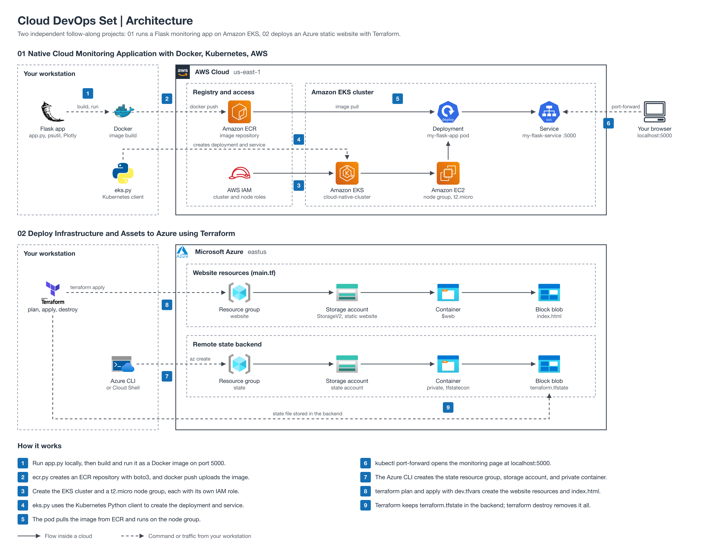

# Cloud DevOps Set

Follow-along projects for containerizing, deploying, and automating cloud workloads on AWS and Azure. Each folder is a self-contained guide with its own steps and code.

The diagram shows what each guide builds: 01 on AWS (Docker, ECR, EKS) and 02 on Azure (Terraform, Storage, remote state).

| Section | What you'll build | Folder |
| --- | --- | --- |
| Native Cloud Monitoring Application with Docker, Kubernetes, AWS | A Flask system-monitoring app, containerized with Docker, pushed to Amazon ECR, and deployed to Amazon EKS from Python | [01-native-cloud-monitoring-app-docker-kubernetes-aws](./01-native-cloud-monitoring-app-docker-kubernetes-aws/) |
| Deploy Infrastructure and Assets to Azure using Terraform | A static website on Azure Storage deployed with Terraform, with remote state and variables | [02-deploy-infrastructure-to-azure-with-terraform](./02-deploy-infrastructure-to-azure-with-terraform/) |

## How to use

Open a folder and follow its README from top to bottom. The projects are independent, so you can start with either one. Both create billable cloud resources, so run each guide's cleanup steps when you finish.

## License

Code and scripts in this repository are licensed under the MIT License (see [LICENSE](LICENSE)). Written guides and diagrams are licensed under [CC BY 4.0](https://creativecommons.org/licenses/by/4.0/). Third-party material keeps its original license and is excluded from both.
